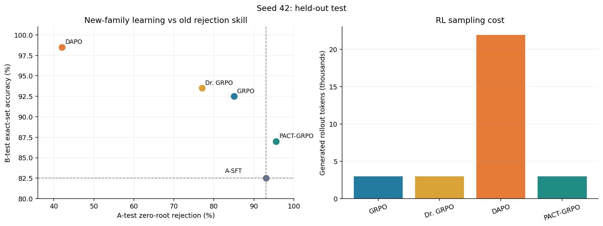
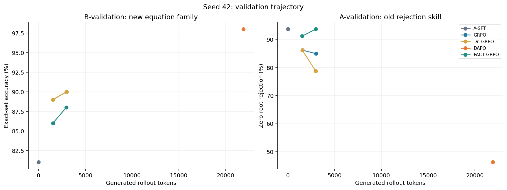
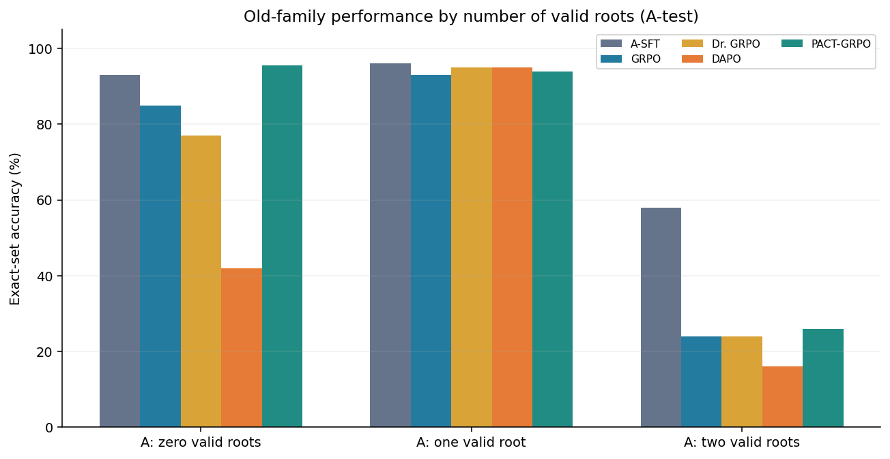

# PACT-GRPO Math: học bài mới và giữ kỹ năng kiểm định nghiệm

Project nghiên cứu **post-training mô hình ngôn ngữ cho một tác vụ toán cụ thể**: kiểm định nghiệm ứng viên của phương trình chứa căn sau khi bình phương hai vế. Câu hỏi thực nghiệm là: khi dùng RL để model làm tốt hơn một nhóm bài mới, liệu ràng buộc hướng cập nhật có giúp nó giữ được kỹ năng đã học trước đó không?

## 1. Bài toán và lý do chọn

Với phương trình `sqrt(kx+a)=mx+b`, bước bình phương có thể tạo **nghiệm ngoại lai**. Bài toán trong project **đã cung cấp các nghiệm ứng viên**; model phải thay từng ứng viên vào phương trình gốc và trả về *đúng toàn bộ tập nghiệm hợp lệ*. Đây là tác vụ *candidate-root verification*, không phải giải phương trình từ đầu.

Ví dụ trong tập B: `sqrt(8x+305)=-4x+9` có hai ứng viên `-2` và `7` sau khi bình phương. Thay vào phương trình gốc: `x=-2` cho hai vế cùng bằng `17`; `x=7` cho vế trái `19` nhưng vế phải `-19`. Đáp án đúng chỉ là `-2`. Một dự đoán được tính đúng khi **tập nghiệm trả về khớp hoàn toàn** với tập nghiệm chuẩn; trả thêm nghiệm ngoại lai cũng là sai.

Vấn đề post-training ở đây là **adaptation–retention trade-off**: RL trên một phân bố bài mới có thể tăng accuracy ở phân bố đó nhưng làm giảm khả năng bác bỏ nghiệm ngoại lai đã học từ SFT. Ràng buộc của PACT-GRPO nhắm vào đúng kỹ năng bác bỏ này. Phạm vi thí nghiệm hẹp và kiểm chứng được; nó không đại diện cho toàn bộ năng lực giải toán của LLM.

## 2. Dữ liệu A/B và quy trình thí nghiệm

**A và B là hai tập bài, không phải tên của thuật toán.** Cả hai có cùng yêu cầu kiểm tra nghiệm; chúng khác về hệ số và phân bố số nghiệm đúng. Dữ liệu được sinh từ `src/pact_grpo/transfer_data.py`, nhãn nghiệm được kiểm tra bằng phép thế vào phương trình gốc, và các tập train/validation/test không trùng phương trình.

| Tập | Đặc điểm | Train | Validation | Test | Vai trò |
|---|---|---:|---:|---:|---|
| **A** | `|m|∈{1,2}`; có bài 0, 1 hoặc 2 nghiệm đúng | 800 | 200 | 350 | Học kỹ năng ban đầu bằng SFT; đo mức giữ kỹ năng sau RL |
| **B** | `|m|∈{3,4}`; mỗi bài có 2 ứng viên, đúng 1 nghiệm | 500 | 100 | 200 | Học phân bố mới bằng RL; đo khả năng thích nghi |

Quy trình gồm bốn bước:

1. **SFT chung trên A-train:** Qwen2.5-Math-1.5B-Instruct được huấn luyện LoRA hai epoch trên 800 bài A. Checkpoint này gọi là **A-SFT** và là điểm xuất phát giống nhau cho bốn method RL. Chỉ tiếp tục nếu A-SFT bác bỏ đúng ít nhất 80% bài vô nghiệm trong A-validation. Các bài A-train vô nghiệm mà A-SFT trả lời đúng được chọn làm anchor của PACT; yêu cầu ít nhất 40 anchor.
2. **RL trên B-train:** GRPO, Dr. GRPO, DAPO và PACT-GRPO được huấn luyện riêng từ A-SFT. Cấu hình pilot: 200 bước nhóm, 4 rollout/nhóm, tối đa 2 policy epoch/bước. Reward gồm điểm đúng toàn bộ tập nghiệm, điểm overlap với nghiệm đúng và điểm định dạng. DAPO được phép lấy mẫu lại nhóm không có chênh lệch reward, tối đa 8 lần/bước.
3. **Theo dõi validation:** B-validation đo việc học bài mới; riêng 80 bài A-validation vô nghiệm đo khả năng bác bỏ nghiệm ngoại lai. Checkpoint trung gian chỉ được xem trên validation.
4. **Đánh giá held-out test:** sau train, đánh giá trên cùng A-test và B-test cho cả A-SFT lẫn bốn method. Test không dùng để chọn checkpoint hay chỉnh ngưỡng.

Tên `hard` trong một số file là nhãn kỹ thuật của họ B. B có hệ số khác và lớn hơn, nhưng **không có bằng chứng rằng mọi bài B đều khó hơn mọi bài A**. Cả hai vẫn là cùng một loại tác vụ; đây là kiểm tra chuyển sang một phân bố khác, chưa phải học một kỹ năng toán hoàn toàn mới.

## 3. PACT-GRPO khác gì GRPO?

GRPO lấy các rollout của một bài B, chấm reward tương đối trong nhóm, rồi tính hướng cập nhật `d_GRPO`. PACT-GRPO dùng **cùng hướng task đó** nhưng thêm một anchor A-train vô nghiệm mà model đã làm đúng. Trên anchor, nó so sánh log-probability của đáp án đúng `none` với một đáp án sai nhận nghiệm ngoại lai. Gradient của độ chênh lệch này là `g_anchor`.

Nếu `g_anchor · d_GRPO < 0`, hướng GRPO theo xấp xỉ bậc nhất sẽ làm giảm độ ưu tiên của đáp án đúng trên anchor. PACT chiếu hướng cập nhật sang hướng gần nhất thỏa `g_anchor · d ≥ 0`:

```text
d_PACT = argmin_d  1/2 ||d - d_GRPO||²
         subject to g_anchor · d ≥ 0
```

Nếu không vi phạm, PACT giữ nguyên hướng GRPO. Với nhóm không có gradient task hữu ích, PACT cũng không biến bước đó thành một bước SFT trên anchor. Ràng buộc này tác động lên **hướng gradient trước optimizer**, nên không bảo đảm mọi cập nhật hữu hạn hoặc mọi bài A-test đều được bảo toàn. Trong lần chạy seed 42, phép chiếu được áp dụng **8 lần**.

Dr. GRPO trong project thay cách chuẩn hóa advantage/độ dài completion; DAPO bổ sung dynamic sampling, clip bất đối xứng và xử lý completion quá dài. Đây là **các bản triển khai trong repository**, không phải phép tái hiện nguyên vẹn trainer chính thức của từng paper; vì vậy không nên so trực tiếp các con số này với số trong paper gốc.

## 4. Kết quả pilot: seed 42

`B-test` có 200 bài. `A-zero` có 200 bài vô nghiệm; `A-all` có 350 bài A-test; `A-two` có 50 bài A-test với hai nghiệm đúng. Mọi cột accuracy dưới đây là **exact-set accuracy**.

| Method | B-test | A-zero | A-all | A-two | Rollout tokens | RL updates |
|---|---:|---:|---:|---:|---:|---:|
| A-SFT, trước RL | 82,5% (165/200) | 93,0% (186/200) | 88,9% (311/350) | 58% (29/50) | — | — |
| GRPO | 92,5% (185/200) | 85,0% (170/200) | 78,6% (275/350) | 24% (12/50) | 2.998 | 36 |
| Dr. GRPO | 93,5% (187/200) | 77,0% (154/200) | 74,6% (261/350) | 24% (12/50) | 2.985 | 34 |
| DAPO | 98,5% (197/200) | 42,0% (84/200) | 53,4% (187/350) | 16% (8/50) | 21.917 | 82 |
| PACT-GRPO | 87,0% (174/200) | 95,5% (191/200) | 85,1% (298/350) | 26% (13/50) | 2.971 | 30 |

So với A-SFT, PACT đúng thêm **9/200 bài B** (+4,5 điểm phần trăm) và bác bỏ đúng thêm **5/200 bài A vô nghiệm** (+2,5 điểm). So với GRPO, PACT giữ A-zero tốt hơn **10,5 điểm** nhưng kém **5,5 điểm** trên B. DAPO đạt B-test cao nhất, song A-zero giảm **51 điểm** so với A-SFT và dùng khoảng **7,3 lần** token rollout của GRPO. DAPO lấy mẫu 1.498 nhóm nhưng chỉ có 41 nhóm hữu ích để cập nhật; 159/200 bước không tìm được nhóm có chênh lệch reward trong giới hạn retry. Vì vậy các method **không tương đương về chi phí lấy mẫu hoặc số update**.

**Giới hạn quan trọng:** PACT không giữ nguyên toàn bộ kỹ năng A. Trên A-test có hai nghiệm, nó giảm từ **58% xuống 26%**, nên A-all cũng giảm từ **88,9% xuống 85,1%**. Kết quả chỉ ủng hộ giả thuyết hẹp rằng constraint hiện tại có thể bảo vệ *khả năng bác bỏ bài vô nghiệm* trong khi vẫn học thêm B; chưa chứng minh chống quên tổng quát. Năm bài A-zero cải thiện và chín bài B cải thiện là tín hiệu pilot, chưa đủ để khẳng định hiệu quả ổn định qua seed hoặc model khác. Điểm B ban đầu đã là 82,5%, nên dư địa cải thiện cũng có giới hạn.

Thời gian A-SFT là khoảng 471 giây, dùng chung cho tất cả method. Thời gian RL riêng: GRPO 201 giây, Dr. GRPO 197 giây, DAPO 335 giây, PACT 211 giây. `rollout tokens` chỉ đếm token completion dùng khi lấy mẫu RL; nó **không phải tổng token huấn luyện hoặc tổng FLOPs**. Dữ liệu tóm tắt và các cặp bài đổi đúng/sai được lưu ở [comparison.csv](docs/results/seed42/comparison.csv) và [comparison.json](docs/results/seed42/comparison.json). Checkpoint và log chi tiết nằm trong `outputs/transfer_v1`, thư mục này bị Git bỏ qua.

## 5. Đọc biểu đồ và notebook



**Hình test:** ở panel trái, trục ngang là khả năng bác bỏ A-zero, trục dọc là độ đúng B-test; hai đường đứt là mốc A-SFT. Đi lên nghĩa là học B tốt hơn, sang phải nghĩa là giữ kỹ năng bác bỏ tốt hơn. PACT nằm trên và bên phải A-SFT **chỉ theo hai chỉ số đang vẽ**; GRPO/Dr. GRPO học B mạnh hơn nhưng dịch trái. Panel phải cho thấy DAPO dùng nhiều token rollout hơn hẳn.



**Hình validation:** chấm ở `x=0` là A-SFT trước RL. Theo token rollout, B-validation tăng từ 81% lên 88% với PACT; A-validation vô nghiệm giảm nhẹ ở giữa rồi trở về 93,75% ở cuối. GRPO và Dr. GRPO học B tốt hơn nhưng A-validation giảm; DAPO có một điểm cuối vì lần chạy này không lưu được checkpoint trung gian khi các bước dynamic sampling bị skip. Các đường GRPO/Dr. GRPO trên B-validation gần như chồng nhau. Đây là validation, không phải test.



**Hình phân rã A-test:** nhìn riêng 0/1/2 nghiệm mới thấy PACT chỉ giữ tốt nhóm A vô nghiệm; nhóm hai nghiệm giảm mạnh. Hình này cần đọc cùng scatter plot để tránh diễn giải PACT là giữ được toàn bộ họ A.

Notebook [visualize_results.ipynb](visualize_results.ipynb) đọc các kết quả trong `outputs/transfer_v1` để xem bảng và plot tương tác trong VS Code. Ba ảnh ở README là **snapshot của seed 42** để có thể xem trên GitHub dù `outputs` không được push. Khi có seed mới, chạy lại notebook và cập nhật ảnh/bảng theo kết quả mới.

## 6. Cách chạy lại trong VS Code

1. Chọn interpreter `tf_gpu` có `torch`, `transformers`, `peft`, `matplotlib` và các dependency trong [requirements.txt](requirements.txt). Kiểm tra `model_name` trong [configs/radical.json](configs/radical.json): hiện là đường dẫn model local trên máy thực nghiệm, cần sửa nếu chạy trên máy khác.
2. Kiểm tra seed, số bước và ngưỡng trong [configs/transfer.json](configs/transfer.json). Để kiểm tra độ ổn định, nên chạy nhiều seed, ví dụ `[42, 43, 44]`, trước khi diễn giải kết quả như một đóng góp thuật toán.
3. Chạy [train.py](train.py), sau đó [evaluate.py](evaluate.py), rồi [compare.py](compare.py).
4. Mở [visualize_results.ipynb](visualize_results.ipynb), chọn kernel cùng environment và **Run All**. Kết quả mới nằm ở `outputs/transfer_v1`.

Mã sẽ dừng trước RL nếu SFT chưa đạt ngưỡng A-validation hoặc không đủ anchor đã làm đúng. Nếu đổi cấu hình SFT sau khi có checkpoint, dùng thư mục output mới thay vì tái sử dụng checkpoint không tương thích. Đánh giá tiếp theo nên có **ít nhất ba seed**, so sánh ở ngân sách token tương đương, báo cáo cả A-zero/A-one/A-two và thử thêm một phân bố bài toán khác. Kết quả seed 42 hiện là **pilot**, không phải bằng chứng rằng PACT-GRPO luôn tốt hơn các baseline.
